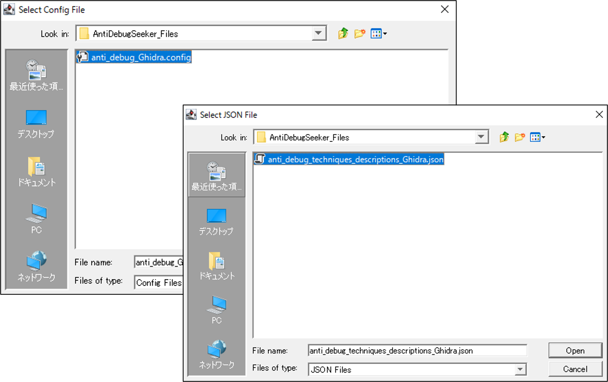
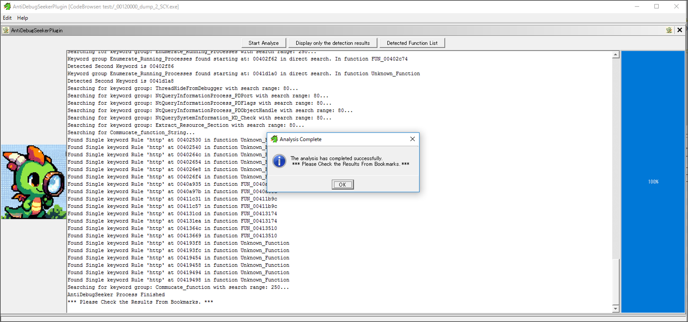
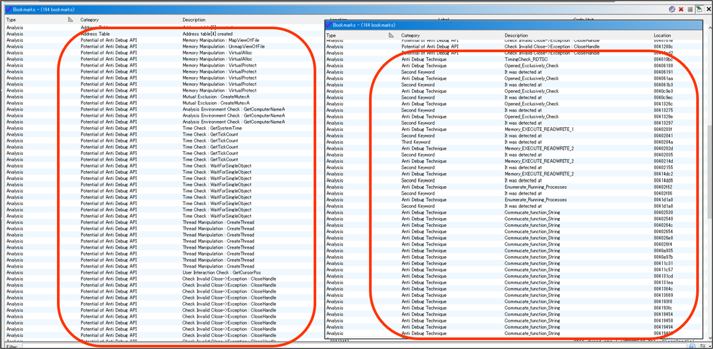

# Ghidra_AntiDebugSeeker  

  

## Introduction

This tool is the Ghidra version of [AntiDebugSeeker](https://github.com/LAC-Japan/IDA_Plugin_AntiDebugSeeker).  
It can be used in two ways: as a Ghidra Script and as a module.  

Through this tool, users can automatically extract potential anti-debugging methods used by malware, making it easier for analysts to take appropriate action.  

The main functionalities of this plugin are as follows:

- Extraction of Windows API that are potentially being used for anti-debugging by the malware  
  (All subsequent API represent the Windows API)  
- In addition to API, extraction of anti-debugging techniques based on key phrases that serve as triggers, as some anti-debugging methods cannot be comprehensively identified by API calls alone.

Additionally, the file that defines the detection rules is designed to easily add keywords you want to detect.  
This allows analysts to easily add new detection rules or make changes.  
  
For packed malware, running this plugin after unpacking and fixing the Import Address Table is more effective.

  

## Files Required to Run the Program  

 1. AntiDebugSeeker.java (Ghidra Script)/    
    ghidra_11.0.1_AntiDebugSeeker.zip (Zip Folder containing the compiled files including AntiDebugSeekerPlugin.java : Ghidra Module Extension)
    
 2. anti_debug_Ghidra.config (Converted for Ghidra : A file containing rules for detecting anti-debugging techniques)
  
 3. anti_debug_techniques_descriptions_Ghidra.json (Converted for Ghidra : A file containing descriptions of the detected rules)

## Ghidra Script How to Run

  Script Manager > AntiDebugSeeker.java > Run Script  
  
  When the script is executed, a message saying "Select the Configuration File" is displayed,   
  so specify the anti_debug_Ghidra.config that defines the detection rules, then click Open.  

  After selecting the config file, a message saying "Select the JSON Description File" is displayed,  
  so specify the anti_debug_technique_descriptions_Ghidra.json, which contains the descriptions of the detection rules, and click Open.  

## Ghidra Module Extension How to Setup and Execute

***Initial Setup***  

  File > Configure > Check Examples > Click Configure > Check AntiDebugSeekerPlugin > Click Ok  

    

    
  
***How to Execute***  

  Window > AntiDebugSeekerPlugin  

    
  
  Click Start Analyze Button  

   
  
***The GUI interface launches.***  
  
  "Select the Config File" is displayed, so specify the anti_debug_Ghidra.config that defines the detection rules, then click Open.  
  
  "Select the JSON Description File" is displayed, so specify the anti_debug_technique_descriptions_Ghidra.json,   
  which contains the descriptions of the detection rules, and click Open.  

     
  
  A progress bar is displayed alongside a moving dragon.  
  When the analysis is complete, "Analysis Complete" will be displayed.  

     
  
  The detection results can be checked from the GUI interface TextArea or Bookmarks.  

  ## Verifying the results (Ghidra Script + Module Extension)  

  Ghidra Script: Check Console-Scripting  
  &nbsp;&nbsp;The results of the detection can be checked from the Console - Scripting screen.   
  &nbsp;&nbsp;When AntiDebugSeeker Process Finished" is displayed, it signals that the process has completed.  

  Ghidra Module Extension : Check Text Area  
  &nbsp;&nbsp;The results of the detection can be checked from Text Area.  
  &nbsp;&nbsp;When AntiDebugSeeker Process Finished" is displayed, it signals that the process has completed.  

  &nbsp;&nbsp;*Display only the detection results Button  
  &nbsp;&nbsp;&nbsp;&nbsp;You can display only the detected results from the outcomes shown by pressing the Start Analyze button.

     
     
  &nbsp;&nbsp;*Detected Function List Button  
  &nbsp;&nbsp;&nbsp;&nbsp;From the results of either the Start Analyze button or the Display only the detection results button,  
  &nbsp;&nbsp;&nbsp;&nbsp;the outcomes are displayed grouped by function.  
  &nbsp;&nbsp;&nbsp;&nbsp;It becomes easier for the user to understand from which function to start checking.  

   

  Ghidra Script / Module Extension : Check Bookmarks  
  &nbsp;&nbsp;Detection results in the Anti Debug API section defined in anti_debug_Ghidra.config .  
  &nbsp;&nbsp;Detection results in the Anti Debug Technique section defined in anti_debug_Ghidra.config .  
  &nbsp;&nbsp;You can check where all the keywords are being detected.  

   

  ## Ghidra Script / Module Extension : Detected Keywords Color
    
  Items detected by the Anti Debug API will have a green background color, and the rule name will be set as a PRE comment.  

   
    
  Items detected by the Anti Debug Technique will have an orange background color, and the rule name will be set as a PRE comment.   
  The details of the rule will be displayed as a POST comment from the data of the loaded JSON file.  

  

  ## List of detectable anti-debugging techniques (Ver1.0)  

The following is a list of rule names defined in the Anti_Debug_Technique section of the antidebug_Ghidra.config.  

VMware_I/O_port  
VMware_magic_value  
HeapTailMarker  
KernelDebuggerMarker  
DbgBreakPoint_RET  
DbgUiRemoteBreakin_Debugger_Terminate  
PMCCheck_RDPMC  
TimingCheck_RDTSC  
SkipPrefixes_INT1  
INT2D_interrupt_check  
INT3_interrupt_check  
EXCEPTION_BREAKPOINT  
ICE_interrupt_check  
DBG_PRINTEXCEPTION_C  
TrapFlag_SingleStepException  
BeingDebugged_check  
NtGlobalFlag_check  
NtGlobalFlag_check_2  
HeapFlags  
HeapForceFlags  
Combination_of_HEAP_Flags  
Combination_of_HEAP_Flags_2  
ReadHeapFlags  
ReadHeapFlags_2  
DebugPrivileges_Check
CreateMutex_AlreadyExist  
CreateEvent_AlreadyExist  
Opened_Exclusively_Check  
EXCEPTION_INVALID_HANDLE_1  
EXCEPTION_INVALID_HANDLE_2  
Memory_EXECUTE_READWRITE_1  
Memory_EXECUTE_READWRITE_2  
Memory_Region_Tracking  
Check_BreakPoint_Memory_1  
Check_BreakPoint_Memory_2  
Software_Breakpoints_Check  
Hardware_Breakpoints_Check  
ChildProcess_Check  
Enumerate_Running_Processes  
ThreadHideFromDebugger  
NtQueryInformationProcess_PDPort  
NtQueryInformationProcess_PDFlags  
NtQueryInformationProcess_PDObjectHandle  
NtQuerySystemInformation_KD_Check  
Extract_Resource_Section  
Commucate_function_String  
Commucate_function  

